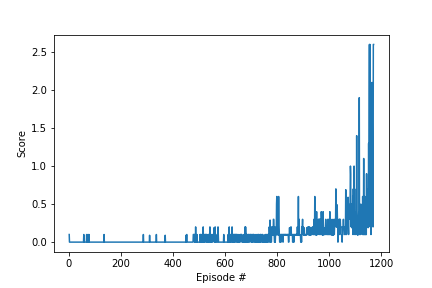

# Collaboration and Competition Project Report

## Overview

This report describes my solution to the Tennis environment as part of 
the Collaboration and Competition project from Udacity Deep Reinforcement Learning Nanodegree.
The implementation I developed solves the environment in 1171 episodes with an average score of .52 over 100 consecutive episodes.

This implementation is heavily inspired by previous work in the Udacity Deep Reinforcement Nanodegree program as well as:

- [Udacity Deep Reinforcement Learning Nanodegree repository](https://github.com/udacity/deep-reinforcement-learning) 
- [DeepRL repository](https://github.com/ShangtongZhang/DeepRL)

## Learning Algorithm

The DDPG algorithm is implemented in the [Tennis.ipynb](Tennis.ipynb) file and utilizes an Actor and Critic class model. 
The actor learns to predict an action vector while the critic learns Q values for state-action pairs. Online and target models are used for the Actor and critic in order to avoid overestimation of Q-values. Additionally, this implementation utilizes experience replay (see class for implementation) to train on randomly sampled batches of uncorrelated experiences. At the end of each episode, scores for each agent are recorded and the maximum of these 2 scores is used to calculate the single reward score.

The DDPG agents are implemented in [maddpg_agent.py](maddpg_agent.py) and the Actor and Critic are implemented in [ddpg_model.py](ddpg_model.py). 

Each agent works as follows:

First, actions are generated for the current state with the online actor model
Then, noise is added using the Ornstein-Uhlenbeck process
Learning is then done in the following way:

1. Experiences are sampled in batches from the replay buffer
2. The online critic model is updated
3. The online actor model is updated
4. The target critic and actor models are updated through soft update and using the parameter vals from the online models

Training takes place in [Tennis.ipynb](Tennis.ipynb), such that the training flow is:
1. The environment is observed at every timestep
2. The agents (loaded from [maddpg_agent.py](maddpg_agent.py)) pick an action
3. The next state, received reward, and whether the episode is completed are observed in the environment
4. This SARSA experience is then added to the replay buffer to be sampled later
5. The agent then uses these experiences to learn and improve aka training. See the implementation for more details on training.

## Network architecture

DDPG uses 2 network architectures: one for the actor and one for the critic.

Actor network architecture:
1. State input (33 units)
2. Hidden layer (256 units) with ReLU activation and batch normalization
3. Hidden layer (256 units) with ReLU activation and batch normalization
4. Action output (4 units) with tanh activation

Critic network architecture:
1. State input (33 units)
2. Hidden layer (256 nodes) with ReLU activation and batch normalization
3. Action input (4 units)
4. Hidden layer with inputs from layers 2 and 3 (256 nodes) with ReLU activation and batch normalization
5. Q-value output (1 node)

## Config Parameters

Initial param values and network architectures came from project 2 of the nanodegree program as well as provided reference implementations. Params were then tweaked, especially the sigma noise value, learning rates, and the network architecture nodes. Param values can be found in [maddpg_agent.py](maddpg_agent.py).

## Results
The agents solved the environment by scoring .5+ over 100 consecutive episodes (the definition of success provided by Udacity) in 1171 episodes. 

Here is a plot of the scores for each episode:

## Considerations for future work
1. Tweaking some of the agent parameters to find optimal values
2. Tweaking the network architectures to more successfully solve the environment
3. Implementing prioritized experience replay and other tools to decrease variation and improve DDPG performance
